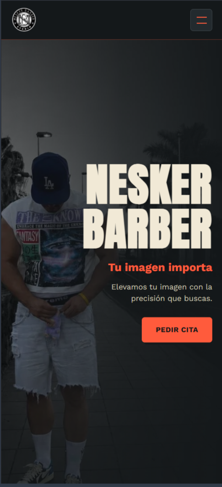
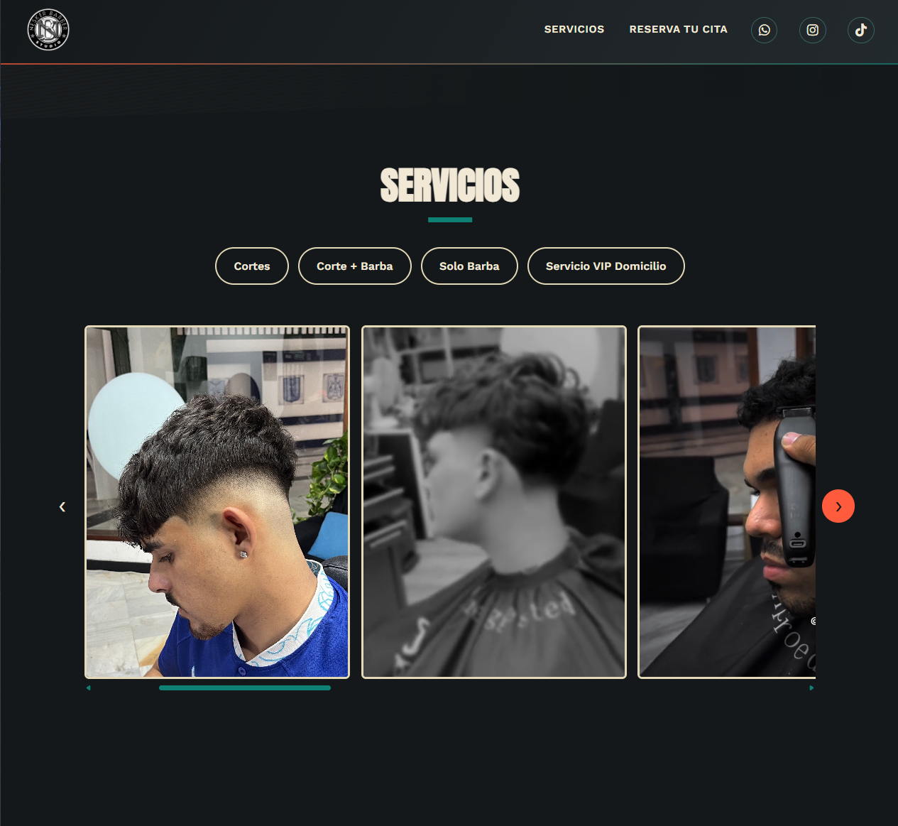
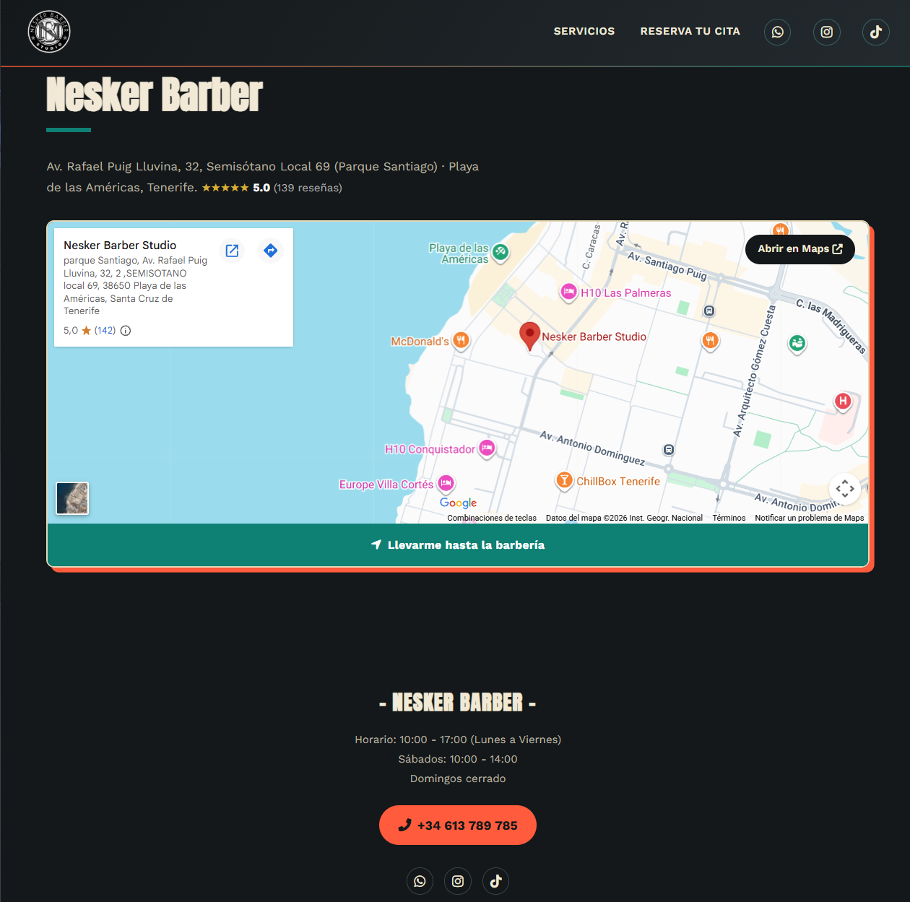
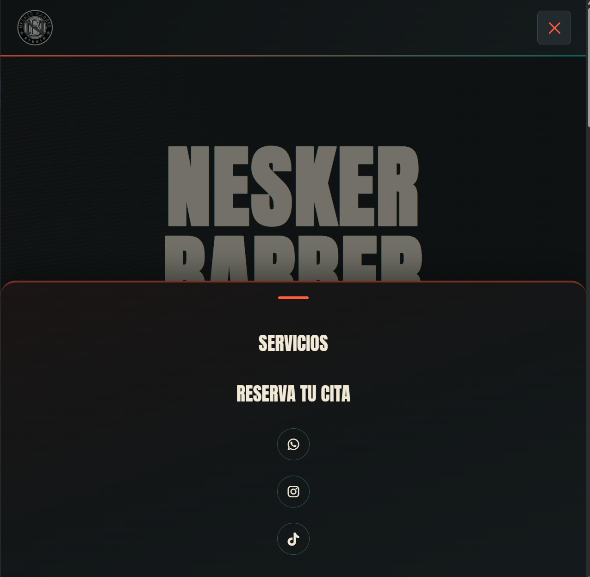

# 💈 Nesker Barber Studio — Sistema de Reservas

[https://nesker-barber-studio.onrender.com/](https://nesker-barber-studio.onrender.com/)

Aplicación web full stack desarrollada para **Nesker Barber Studio**, una barbería situada en Playa de las Américas, Tenerife.

Este proyecto nace de una necesidad real: crear una web que permita a los clientes consultar los servicios de la barbería y realizar sus reservas online.

He desarrollado el proyecto para poner en práctica mis conocimientos de **Python, FastAPI, SQLAlchemy y desarrollo web**, trabajando tanto en el backend como en la parte frontend.

## 📸 Capturas de la aplicación

### Página principal

#### Escritorio


#### Móvil



### Servicios y galería



### Ubicación y contacto



### Navegación responsive



## 🚀 Funcionalidades

### Para clientes

- Visualización de los servicios disponibles.
- Sistema de reservas online.
- Selección de fecha y hora.
- Comprobación de disponibilidad.
- Validación de los datos enviados.
- Prevención de reservas duplicadas.
- Control de días y horarios no disponibles.
- Confirmación de la reserva.
- Envío de notificaciones de nuevas reservas mediante Telegram.
- Información de contacto y ubicación de la barbería.

### Para administración

- Acceso protegido mediante autenticación.
- Visualización de las reservas.
- Eliminación de reservas.
- Gestión de días bloqueados.
- Consulta de estadísticas de reservas, con archivado automático mes a mes.

## 🛠️ Tecnologías utilizadas

### Backend

- Python
- FastAPI
- SQLAlchemy
- Pydantic
- Uvicorn
- Jinja2
- HTTPX
- python-dotenv

### Frontend

- HTML5
- CSS3
- JavaScript

### Base de datos

- SQLite durante el desarrollo.
- SQLAlchemy como ORM para trabajar con la base de datos.
- La aplicación está preparada para utilizar PostgreSQL mediante la variable de entorno `DATABASE_URL`.

### Integraciones

- Telegram Bot API para recibir notificaciones de nuevas reservas.

## 📁 Estructura del proyecto

```text
BARBERIA-APP/
│
├── routers/
│   ├── reservas.py
│   ├── bloqueos.py
│   ├── disponibilidad.py
│   ├── estadisticas.py
│   └── paginas.py
│
├── static/
│   ├── css/
│   ├── js/
│   └── img/
│
├── templates/
│   ├── index.html
│   └── admin.html
│
├── screenshots/
│   ├── screenshot1.png
│   ├── screenshot2.png
│   ├── screenshot3.png
│   ├── screenshot4.png
│   └── screenshot5.png
│
├── auth.py
├── database.py
├── models.py
├── schemas.py
├── horario.py
├── paths.py
├── estadisticas.py
├── telegram.py
├── template_engine.py
├── main.py
├── init_db.py
├── requirements.txt
├── .env.example
└── LICENSE
```

## ⚙️ Instalación

### 1. Crear un entorno virtual

```bash
python -m venv .venv
```

En Windows:

```bash
.venv\Scripts\activate
```

### 2. Instalar las dependencias

```bash
pip install -r requirements.txt
```

### 3. Configurar las variables de entorno

Copia `.env.example` como `.env` y rellena tus propios valores:

```bash
cp .env.example .env
```

Las credenciales y tokens reales no deben subirse al repositorio (`.env` está en `.gitignore`).

### 4. Inicializar la base de datos

```bash
python init_db.py
```

### 5. Ejecutar la aplicación

```bash
uvicorn main:app --reload
```

La aplicación estará disponible en:

```text
http://127.0.0.1:8000
```

Y la documentación interactiva de la API, generada automáticamente por FastAPI, en:

```text
http://127.0.0.1:8000/docs
```

## 🔐 Seguridad

Las credenciales de administración y los datos necesarios para las integraciones externas se gestionan mediante variables de entorno.

El panel de administración está protegido mediante autenticación HTTP Basic, comparando usuario y contraseña con `secrets.compare_digest` en vez de una comparación normal, para evitar que el tiempo de respuesta pueda filtrar información sobre la contraseña correcta.

El archivo `.env` debe mantenerse fuera del repositorio.

## 📅 Sistema de reservas

Antes de crear una reserva, el backend comprueba que la fecha y hora seleccionadas estén disponibles.

También controla situaciones como:

- Días bloqueados.
- Domingos.
- Horarios fuera de servicio.
- Reservas duplicadas.
- Datos incorrectos o incompletos.

Cuando una reserva se crea correctamente, se guarda en la base de datos y se envía una notificación mediante Telegram.

### Archivado automático de estadísticas

Cada mes que termina se archiva automáticamente: al crear una reserva nueva o al abrir el panel de administración, la aplicación comprueba si quedan citas de meses ya cerrados, cuenta cuántas hubo y las guarda en un histórico mensual, borrándolas después de la tabla activa.

De esta forma, el panel se mantiene ligero sin perder el dato de cuántos clientes se atendieron cada mes y sin depender de ninguna tarea programada (cron) externa que en un hosting gratuito no siempre está garantizado que se ejecute.

## 🎯 Qué he trabajado en este proyecto

Este proyecto me ha servido para practicar y entender mejor diferentes partes del desarrollo backend con Python:

- Creación de una API con FastAPI.
- Organización del backend mediante routers.
- Creación de modelos y consultas con SQLAlchemy.
- Validación de datos con Pydantic.
- Conexión entre el backend y una base de datos.
- Gestión de variables de entorno.
- Autenticación para el panel de administración, evitando fallos como una doble autenticación accidental (la ruta `/admin` no exige credenciales porque el HTML en sí no tiene datos sensibles, solo las llamadas a la API que sí los devuelven).
- Prevención de XSS en el panel de administración, construyendo el HTML dinámico con `textContent`/`createElement` en vez de `innerHTML`, para que un dato introducido por un cliente no pueda ejecutarse como código en el navegador del admin.
- Integración con una API externa.
- Desarrollo de un frontend conectado con el backend.
- Implementación de la lógica necesaria para gestionar reservas.

## 📌 Estado del proyecto

El proyecto está **funcional y preparado para su despliegue**.

El siguiente paso es llevarlo a producción, configurar PostgreSQL y conectar el dominio de la barbería.

## 📄 Licencia

Este proyecto está bajo licencia [MIT](LICENSE).

## 👨‍💻 Sobre el proyecto

Este proyecto forma parte de mi portfolio mientras sigo formándome como **Backend Python Junior**.

Mi objetivo con estos proyectos es seguir mejorando mis conocimientos y adquirir experiencia práctica desarrollando aplicaciones que puedan utilizarse en situaciones reales.